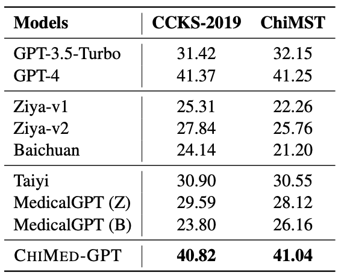

# ChiMed-GPT

ChiMed-GPT is a Chinese medical large language model (LLM) that is built by continually training [Ziya-v2](https://arxiv.org/abs/2311.03301) on Chinese medical data, where pre-training, supervised fine-tuning (SFT), and reinforcement learning from human feedback (RLHF) are performed.

More information about the model is coming soon.

## Citation

If you use or extend our work, please cite the following [paper]():
```
@article{USTC-ChiMed-GPT,
  title="{ChiMed-GPT: A Chinese Medical Large Language Model with Full Training Regime and Better Alignment to Human Preferences}",
  author={Yuanhe Tian, Ruyi Gan, Yan Song, Jiaxing Zhang, Yongdong Zhang},
  journal={arXiv preprint arXiv:0000.00000},
  year={2023},
}
```

## Training Process

The overall training process of ChiMed-GPT is illustrated in the following figure.


## Results

We evaluate ChiMed-GPT on information extraction, question answering (QA), and multi-turn dialogue.

### Information Extraction

The results on CCKS2019 and [ChiMST](https://github.com/synlp/ChiMST) are



### QA

The results are


### Multi-turn Dialog

The results on [MC](https://aclanthology.org/2020.coling-main.63/)


## Download

The version 1.0 is released at [Huggingface](https://huggingface.co/SYNLP/ChiMed-GPT-1.0).


## Usage

