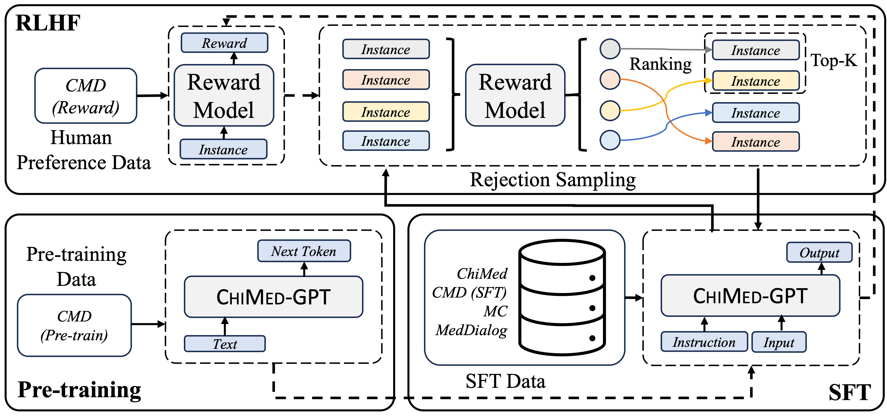
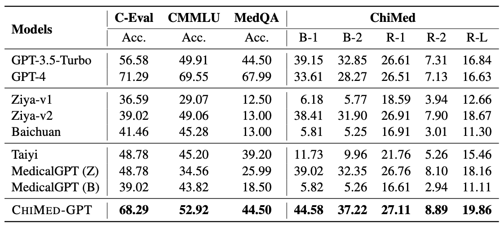
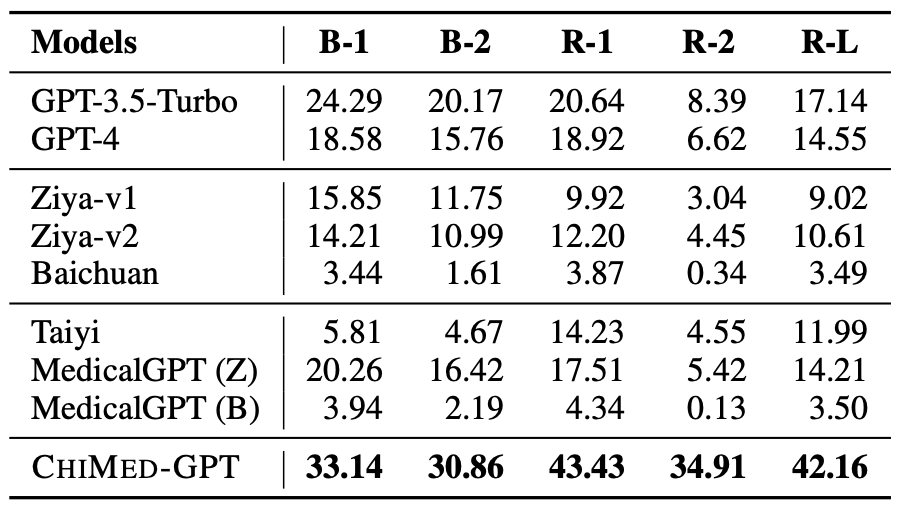

# ChiMed-GPT

ChiMed-GPT is a Chinese medical large language model (LLM) that is built by continually training [Ziya-v2](https://arxiv.org/abs/2311.03301) on Chinese medical data, where pre-training, supervised fine-tuning (SFT), and reinforcement learning from human feedback (RLHF) are performed.

More information about the model is coming soon.

## Citation

If you use or extend our work, please cite the following [paper]():
```
@article{USTC-ChiMed-GPT,
  title="{ChiMed-GPT: A Chinese Medical Large Language Model with Full Training Regime and Better Alignment to Human Preferences}",
  author={Yuanhe Tian, Ruyi Gan, Yan Song, Jiaxing Zhang, Yongdong Zhang},
  journal={arXiv preprint arXiv:0000.00000},
  year={2023},
}
```

## Training Process

The overall training process of ChiMed-GPT is illustrated in the following figure.



## Results

We evaluate ChiMed-GPT on information extraction, question answering (QA), and multi-turn dialogue.

### Information Extraction

The results on CCKS2019 and [ChiMST](https://github.com/synlp/ChiMST) are

| Models          | CCKS-2019 | ChiMST |
|-----------------|-----------|--------|
| GPT-3.5-Turbo   | 31.42     | 32.15  |
| GPT-4           | 41.37     | 41.25  |
| Ziya-v1         | 25.31     | 22.26  |
| Ziya-v2         | 27.84     | 25.76  |
| Baichuan        | 24.14     | 21.20  |
| Taiyi           | 30.90     | 30.55  |
| MedicalGPT (Z)  | 29.59     | 28.12  |
| MedicalGPT (B)  | 23.80     | 26.16  |
| CHiMed-GPT      | 40.82     | 41.04  |

### QA

The results are




### Multi-turn Dialog

The results on [MC](https://aclanthology.org/2020.coling-main.63/)




## Download

The version 1.0 is released at [Huggingface](https://huggingface.co/SYNLP/ChiMed-GPT-1.0).


## Usage
```python
from transformers import AutoTokenizer
from transformers import LlamaForCausalLM
import torch

query="[human]:感冒怎么处理？\n[bot]:"
model = LlamaForCausalLM.from_pretrained('SYNLP/ChiMed-GPT-1.0', torch_dtype=torch.float16, device_map="auto").eval()
tokenizer = AutoTokenizer.from_pretrained(ckpt)
input_ids = tokenizer(query, return_tensors="pt").input_ids.to('cuda:0')
generate_ids = model.generate(
            input_ids,
            max_new_tokens=512, 
            do_sample = True, 
            top_p = 0.9)
output = tokenizer.batch_decode(generate_ids)[0]
print(output)
```
